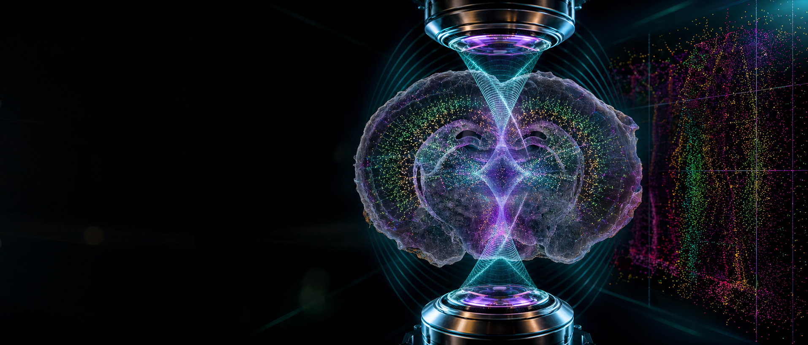

<p align="center">
  
</p>

<h1 align="center">4Pi-BRAINSPOT</h1>

<p align="center">
  <strong>Interferometric ultra-high resolution 3D imaging through brain sections</strong>
</p>

<p align="center">
  <a href="http://4pi-brainspot.xulab.cc/"></a>
  <a href="https://www.nature.com/articles/s41467-026-71614-6"></a>
  <a href="https://doi.org/10.1038/s41467-026-71614-6"></a>
  <a href="https://www.mathworks.com/"></a>
  <a href="https://developer.nvidia.com/cuda-downloads"></a>
</p>

<p align="center">
  <a href="http://4pi-brainspot.xulab.cc/">Project page</a>
  ·
  <a href="https://github.com/XuLab-BIT/4Pi-BRAINSPOT/archive/refs/heads/main.zip">Download toolbox</a>
  ·
  <a href="4Pi-BRAINSPOT%20software%20instruction.pdf">Software instruction</a>
  ·
  <a href="4Pi-BRAINSPOT%20Supplementary%20analysis/4Pi-BRAINSPOT%20Supplementary%20analysis%20Instruction.pdf">Supplementary analysis</a>
</p>

## Overview

**4Pi-BRAINSPOT** is a MATLAB toolbox for
**interferometric ultra-high resolution 3D imaging through brain sections.**
It reconstructs nanoscale 3D molecular information from 4Pi single-molecule
switching nanoscopy datasets by combining in situ coherent PSF retrieval,
dynamic interferometric correction, GPU localization, drift correction, and
volume visualization.

The project page hosts the article links and supplementary movies:
**http://4pi-brainspot.xulab.cc/**

## What It Does

| Capability | Purpose |
| --- | --- |
| Four-channel import | Load p1, s2, p2, and s1 interferometric image stacks with camera metadata. |
| Channel alignment | Register detection paths using affine transforms or fresh calibration data. |
| In situ 4Pi PSF retrieval | Recover sample-aware coherent PSF models directly from molecular datasets. |
| Dynamic model update | Estimate cavity phase shifts and objective-misalignment changes over time. |
| CUDA localization | Run pupil-based 3D localization with GPU acceleration. |
| Post-processing | Perform rejection, 3D drift correction, volume alignment, and axial color display. |

## Key Results

- Achieves sub-15 nm 3D molecular resolution in thick brain sections.
- Enables 3D imaging in 50 um mouse brain slices with tissue clearing and light-sheet illumination.
- Achieves 6.4 nm lateral and 2.9 nm axial localization precision.
- Integrates in situ coherent PSF retrieval, dynamic model correction, GPU localization, and 3D visualization in the 4Pi-BRAINSPOT workflow.

## Repository Layout

```text
4Pi-BRAINSPOT toolbox/        MATLAB GUI and reconstruction workflow
Support/                      Helper functions, PSF toolbox, SR/sCMOS utilities
Data_4pi/                     Demo data and calibration files
4Pi-BRAINSPOT Supplementary analysis/
                              Companion analysis scripts and instruction PDF
docs/                         GitHub Pages site and supplementary videos
```

## Requirements

- Windows 7 or later, 64-bit.
- MATLAB R2019b, 64-bit.
- CUDA 7.5 compatible graphics driver for GPU-based localization.
- A CUDA-capable GPU is required for the localization module.

## Quick Start

1. Download or clone this repository.
2. Open MATLAB and switch to the repository folder.
3. Open `4Pi-BRAINSPOT toolbox/main.m`.
4. Confirm that the support path points to the `Support` folder.
5. Run `main.m` to launch the GUI.

## Workflow

1. **Setup** - Configure pixel size, NA, refractive indices, camera gain/offset, and optional sCMOS calibration.
2. **Data Import** - Import four detection-channel stacks and optionally apply temporal median background subtraction.
3. **Channel Alignment** - Align channels with calculated or imported affine transforms.
4. **4Pi PSF Segmentation** - Crop isolated molecular sub-regions for PSF model construction.
5. **In Situ PSF Retrieval** - Estimate pupil magnitude, pupil phase, Zernike coefficients, and retrieved 4Pi PSFs.
6. **Dynamic Model Update** - Correct time-varying cavity phase and objective mismatch.
7. **4Pi Localization** - Run GPU localization, quality rejection, drift correction, and volume alignment.
8. **Display** - Render x-y views with molecules color-coded by axial position.

## Demo Data

The `Data_4pi` folder includes a compact demonstration dataset:

- `rawData_4Pi.mat` - sample 4Pi single-molecule dataset.
- `config_4Pi.mat` - general setting parameters.
- `tform_all.mat` - alignment calibration file.
- `sCMOS_calibration_4Pi.mat` - sCMOS calibration parameters.
- `recon4Pi.mat` - sample reconstruction result.

## Citation

If this toolbox supports your work, please cite:

> Hao-Cheng Gao, Fan Xu, Xi Cheng, Tailong Chen, Cheng Bi, Yue Zheng, Yilun Li,
> Yumian Li, Alexander A. Chubykin, and Fang Huang.
> **Interferometric ultra-high resolution 3D imaging through brain sections.**
> *Nature Communications* (2026).
> https://doi.org/10.1038/s41467-026-71614-6

## Authors

This software is developed as companion code for the 4Pi-BRAINSPOT study.

- Purdue University
- Beijing Institute of Technology
- Correspondence: Fan Xu, Alexander A. Chubykin, Fang Huang
